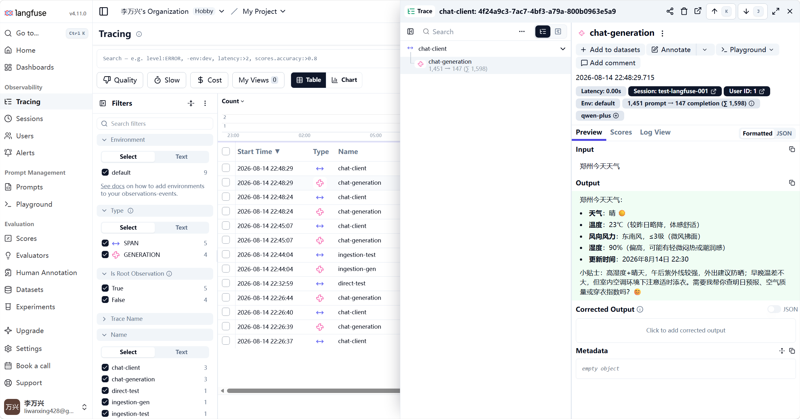

# 工程设计与思考

> 本文档梳理项目中的工程设计决策与踩坑经验，聊到项目时的素材参考。

---

## 1. 统一异常处理

**Q：你们项目怎么做异常处理的？**

全局异常处理器（`@RestControllerAdvice`），所有 Controller 抛出的异常统一捕获，返回标准 `{code, message, data}` 格式，前端不用处理五花八门的错误格式。

**异常分层：**

| 异常类型 | 触发场景 | 处理方式 |
|---------|---------|---------|
| `BusinessException` | 业务逻辑校验失败（用户不存在、参数非法） | 捕获后返回对应业务错误码 |
| `MethodArgumentNotValidException` | `@Valid` 参数校验失败 | 取第一条校验错误返回 |
| `NotLoginException` | Sa-Token 拦截器：未登录 | 返回 401 |
| `NotRoleException` / `NotPermissionException` | Sa-Token：角色/权限不足 | 返回 403 |
| `Exception`（兜底） | 未预料的异常 | 返回 500，记录完整堆栈 |

**为什么继承 RuntimeException 而不是 Exception？**

Checked Exception 要求方法签名声明 `throws`，调用链每层都得加，代码臃肿。RuntimeException 不需要声明 `throws`，直接 throw，配合全局异常处理器兜底，代码干净。

**为什么需要 Assert 工具类？**

Service 层校验业务条件，不满足时直接 `Assert.notNull(user, ResultCode.NOT_FOUND)` 抛业务异常，避免 Controller 里到处写 if-null-return。本质是把防御性校验从 Controller 下沉到 Service。

---

## 2. Sa-Token 认证授权

**Q：用的什么认证方案？为什么不用 Spring Security？**

Sa-Token，轻量级权限框架。Spring Security 功能强大但配置复杂，Sa-Token 几行代码搞定登录拦截 + 权限校验，学习项目不需要 Security 的全部能力。

**实现方式：**

- 拦截器注册 `SaInterceptor`，拦截所有请求检查登录状态
- 登录接口生成 Token，存 Redis（支持多设备同时登录）
- 接口级权限用 `@SaCheckRole("admin")` / `@SaCheckPermission("user:delete")` 注解
- RBAC 五表模型：用户 → 角色 → 权限，三张中间表

**一个细节：SSE 流式接口的登录问题**

SSE 连接建立时校验通过了，但流式响应完成后 Spring 会触发一次 async dispatch（第二次经过拦截器），此时 HTTP 上下文已销毁，用 Sa-Token 校验必报错。解决：拦截器里判断 `DispatcherType.ASYNC` 直接跳过。

---

## 3. Resilience4j 熔断器

**Q：项目里怎么做服务保护的？**

外部服务可能宕机或超时，没有熔断时每个请求都傻等 → Tomcat 线程耗尽 → 连正常请求都处理不了（级联故障）。

用 Resilience4j 的 `@CircuitBreaker` 注解保护，工作原理类似电路开关：

```
Closed（正常）→ 失败率超阈值 → Open（熔断，直接拒绝）→ 等待时间到 → Half-Open（放少量请求试探）→ 成功回 Closed
```

**保护两个地方：**

- **AiClientService**（LLM 主调用）：`@CircuitBreaker(name="llmCircuitBreaker")`，通义千问 API 异常时自动熔断降级
- **ResearchTool**（Python Agent）：`@CircuitBreaker(name="researchCircuitBreaker")`，Python Agent 挂了时快速失败，不傻等 5 分钟超时

熔断器配置直接写在 `application.yml` 的 `resilience4j.circuitbreaker.instances` 下，不需要 Java 配置类。

**为什么不用 Hystrix？**

Netflix 已停止维护，Resilience4j 是其替代者，且原生支持 Spring Boot 3/4，和 Spring AI 生态集成更好。

**和 Sentinel 的区别？**

Sentinel 是阿里开源的流量治理平台，自带 Dashboard 控制台，适合几十个微服务统一管控、运行时动态调规则。Resilience4j 是纯嵌入式库，零外部依赖，和 Spring AI 生态直接集成。你的项目只需要应用内保护外部调用，不需要额外部署 Dashboard，Resilience4j 更轻量合适。


## 4. Spring AI Function Calling（Agent 模式）

**Q：Agent 是怎么实现的？**

用 Spring AI 的 Function Calling 机制。工具池：5 个本地工具（RagTool、TimeTool、WeatherTool、UserQueryTool、ResearchTool）+ MCP 动态发现工具（graph-analysis，开关可关），按请求动态筛选后注册（见下节），模型根据用户问题自主决定调哪个工具，不需要手写路由逻辑。

问"请假怎么请" → 模型调 RagTool（查知识库）
问"北京天气" → 模型调 WeatherTool（调高德 API）
问"你好" → 不调工具，直接回答

**和直接调 OpenAI API 的区别？**

Spring AI 封装了 Tool 定义的 JSON Schema 生成、Tool Call 结果的序列化回传、多轮对话的消息管理。不用自己拼 Function Calling 的 JSON 格式。

---

## 5. 工具动态筛选（三层漏斗）

**Q：工具是怎么注册给模型的？**

不是全量注册，而是每次请求动态筛选。全量注册时每个工具的 name + description + 参数 Schema 都随请求发给模型——工具一多，token 固定开销线性膨胀，且候选越多模型选得越不准（误选/犹豫/绕开工具硬答）。

ToolRegistryService 三层漏斗逐层收敛：

| 层 | 规则 | 为什么要单独一层 |
|---|------|----------------|
| ① 常驻 | TimeTool 这类万金油不走检索，永远注册 | 向量召回靠语义相似，“现在几点”和“时间工具描述”未必对得上，漏召回有它兜底 |
| ② 权限 | `@ToolPermission` 标注的工具（如 UserQueryTool 挂 user:list），无权限码直接排除出候选池 | 权限是安全约束不是相关性问题；模型调工具绕过接口层，`@SaCheckPermission` 拦不住，候选池必须再挡一道 |
| ③ 向量预筛 | query 与工具描述算相似度，top-3 召回（RAG of tools） | 向量负责召回（全量→K 个），function calling 负责精选（K 个→调哪个）；预筛成本仅一次 embedding |

**索引与本体分离：** Milvus 里只存“目录”（工具名 + 描述 + 权限码），工具实现还是 Spring 容器里的 Bean，两边靠工具名关联。加新工具 = 写工具类 + 登记一行，启动时自动重建索引（描述改了重启即生效，不留脏数据）。

**MCP 远程工具也收编这条路：** MCP 工具到本地同样是 ToolCallback，包上熔断后进同一套索引与筛选（AiConfig 不再 builder 级全量注册）。远程调用成本比本地高，更有理由按需带。

**降级：** Milvus 不可用时退回“常驻 + 权限内全量注册”——筛选是优化不是功能，挂了最多多花点 token，不能让 Agent 没工具可用。

---

## 6. RAG 知识库（七段式质量链路）

**Q：RAG 是怎么做的？**

不是"向量检索一把搜"，而是七段流水线，每段解决一个具体的质量问题：

```
① 查询改写：口语→规范（"那个报销的东西在哪点"→"费用报销流程 操作入口"），
   Multi-Query 生成 3 个变体提升召回
② 混合检索：向量（语义）+ MySQL 全文（字面）两路并行，
   CompletableFuture.allOf 协调，单路失败降级空结果不拖全局
③ RRF 融合 + 粗筛（同一方法，都在 Rerank 前）：各路结果按排名倒数 1/(k+rank) 求和统一打分，
   多路共识的 chunk 天然靠前；融合分 top-8 才送精排（Rerank 按条数计费、时延线性，先砍量）
④ Rerank 精排：gte-rerank-v2 交叉编码器，用原始查询（不是改写后的）对齐真实意图
⑤ 窗口扩容 + 临近拼接（small-to-big）：命中的 top-3 反查相邻段拼成完整上下文——
   chunk ID 格式 doc{docId}_{index} 自带位置，一条元组 IN 取回邻居；同文档相邻命中拼成一整段
⑥ 合并后复评 + 置信度门控（CombMNZ 思想）：拼接后的 span 重新聚合打分——
   同时含向量命中和关键词（倒排）命中的加成 1.2，门控在最终拼接结果上拒答/放行
⑦ 生成：基于精排 + 扩容后的完整片段回答
旁路：语义缓存——相似问题命中直接返回旧答案（0 token、毫秒级）
```

索引侧：上传文档 → Tika 解析 → 切分（TOKEN/FIXED/SEMANTIC 三策略）→ Embedding 向量化 → 存入 Milvus。

**为什么需要 Rerank？**

Embedding 向量检索是"粗筛"（语义相似度），Rerank 是"精排"（交叉编码器逐对比较相关性）。粗筛召回 20 条 → 精排后取 Top 5，准确率显著提升。

**RRF 融合解决什么？为什么不用“先到优先”合并？**

putIfAbsent 让“原查询那路”垄断去重，变体检到的高分无法反超。RRF（Reciprocal Rank Fusion）只用排名不用原始分——向量的 cosine 分和 MySQL 全文分不可比，排名才是公共语言；k=60 平滑后“4 路都命中”的 chunk 天然比“单路第 1 名”高（多路共识 > 单路自信）。纯函数计算毫秒级，融合和粗筛在同一个方法里收尾：融合完顺手砍到 top-8 再送精排。

**窗口扩容（small-to-big）解决什么？合并后为什么还要再打一轮分？**

切分边界常把答案切成两半——问“报销标准”，答案正好骑在 chunk 3/4 的边界上，模型只能看到半截。命中后反查相邻段拼接：chunk ID 自带 doc{docId}_{index} 位置，一条 (document_id, chunk_index) 元组 IN 取回所有邻居（不逐段查，防 N+1），同文档里窗口相邻/重叠的命中再拼成一整段。代价控制：只对精排后的 top-3 扩容、半径 1。

拼接完再打一轮是 CombMNZ 思想（经典多路融合打分家族，Elasticsearch hybrid search 同款）：拼接前的单个命中可能只被向量路命中，但合并后的 span 里可能同时含向量命中和关键词（倒排）命中——“语义像”+“字面像”双重佐证。落地为双路命中加成（maxRerank × 1.2，启发式可调）。置信度门控也放在这一步之后：到这时才拿到模型真正要看的最终资料，对它拒答/放行才合理。

**切分策略怎么选的？**

支持 TOKEN / FIXED_LENGTH / SEMANTIC 三种。TOKEN 切分是默认，语义切分效果最好但依赖模型，Fixed Length 简单粗暴但可能切断句子。

**置信度阈值怎么定的？**

Rerank 分数不是概率是相对值。阈值宁低勿高（0.3 起步）——设高了把该答的拒掉，比答得一般更伤体验。校准方法：批量跑评估集看分数分布。

---

## 7. 三层记忆系统

**Q：记忆系统怎么设计的？**

| 层级 | 存储 | 生命周期 | 说明 |
|------|------|---------|------|
| 短期窗口 | MySQL（`SPRING_AI_CHAT_MEMORY`） | 同一会话 | **存 500 条 / 模型读 30 条分离**（见下） |
| 对话摘要 | MySQL | 同一会话 | 超出 20 条部分自动压缩为摘要注入 system |
| 长期记忆 | MySQL + Milvus 双写 | 永久 | AI 自动提取用户偏好，跨所有会话生效 |

**为什么双写 MySQL + Milvus？**

MySQL 存文本（精确查询、编辑、删除），Milvus 存向量（语义检索）。用户说"我喜欢 Python"，长期记忆提取后存入，下次问相关问题时语义检索召回。

**Q：什么是存用分离？为什么需要？**

MessageWindowChatMemory 默认把"存多少"和"模型看多少"绑死：maxMessages=30 时数据库物理只剩 30 条，用户点开历史会话，早期对话凭空消失——存储被上下文策略绑架了。

解决：装饰器模式。`ReadLimitChatMemory` 只装饰 `get()`（读取时截最近 30 条），写入全量透传，存储窗口由内层 500 控制。三个数字各司其职：

- **500** = 存多少（数据库完整档案，约 250 轮，供历史回看）
- **30** = 读多少（模型上下文窗口 = 摘要缓冲区：20 保留 + 10 溢出压缩）
- **20** = 摘要后保留多少条原文

关键细节：这层包在 Advisor 构造处而不是 ChatMemory Bean 上——`/messages` 回看接口注入的是原始 Bean，拿到全量历史，两路互不干扰。

**MediaStrippingChatMemory 是什么？**

多模态消息（含图片）存数据库前剥离 base64 媒体数据，只保留文本，避免数据库膨胀。一个 base64 图片可能几 MB，存进去很快撑爆数据库。

与 ReadLimitChatMemory 是嵌套关系而非替换：内层剥图（写入侧），外层截读（读取侧），两层装饰器各司其职。

---

## 8. AOP 日志切面

**Q：怎么做接口日志的？**

`@Aspect` 切面拦截所有 Controller 方法，环绕通知记录：方法名、入参、耗时、异常信息。不侵入业务代码，一个注解搞定。

用 `@Around("execution(* com.liwx.aiassistant..controller..*.*(..))")` 切所有 Controller 包下的方法。

---

## 9. RestClient 连接池

**Q：外部 HTTP 调用怎么做性能优化的？**

默认的 SimpleClientHttpRequestFactory 每次请求新建 TCP 连接（三次握手 → 请求 → 四次挥手），高并发下大量 TIME_WAIT 端口。

用 Apache HttpClient 5 的 PoolingHttpClientConnectionManager 做连接池，全局共享一个 RestClient Bean：
- 最多 200 个 TCP 连接同时存活
- 每个目标地址最多 20 个并发连接
- ResearchTool 复用连接池但设置 5 分钟读超时（深度调研耗时长）
- WeatherTool 用默认的 5 秒超时

面试一句话：连接池复用 TCP 连接，省掉握手开销，高并发下避免端口耗尽。

---

## 10. 用户级限流

**Q：怎么做限流的？**

Guava `RateLimiter`，每个用户一个限流器，QPS 上限 0.167（即 10 秒 1 次）。Guava Cache 自动清理 1 小时不活跃用户的限流器，避免内存泄漏。

为什么不用 Sentinel 或 Resilience4j 的 RateLimiter？用户数少、限流逻辑简单，Guava 最轻量，不需要引入额外框架。

---

## 11. SSE 流式对话

**Q：流式输出怎么做的？**

同步调用 LLM + 后端按行拆成 SSE 事件推送，前端 `fetch` + `ReadableStream` 逐行读取。

**为什么不用真流式（Flux/WebFlux）？**

踩坑：DashScope 流式响应里工具调用 ID 为空，Function Calling 链路断裂。务实方案：同步调用（工具 ID 完整）+ 拆行假流——体感接近流式，工程上绕开供应商 bug。

**一个坑：** SSE 协议中换行是事件分隔符。如果整段 markdown 作为一个事件发出，前端只能收到第一行。解决：后端按 `\n` 拆成多行，每行单独走一个 `data:` 事件。

---

## 12. 跨语言 Agent 协作

**Q：Java 项目怎么和 Python Agent 协作？**

HTTP 调用，统一 `POST /接口名 + {"query": "..."}` 格式。Java 项目通过 `ResearchTool` 调 Python LangGraph Agent 的 `/research` 接口，拿到调研报告后返回给模型。

后端到后端通信，不需要 CORS。Python Agent 独立部署，端口 8000。

---

## 13. Langfuse 可观测性

**Q：怎么做 AI 调用的监控？**

Langfuse（开源 LLM 可观测性平台），通过自定义 Advisor 在每次 ChatClient 调用时上报：输入/输出、token 用量、延迟、工具调用记录。

用 @ConditionalOnProperty(name=\"spring.ai.langfuse.enabled\", havingValue=\"true\") 控制 Bean 是否创建：
- 没配 enabled=true → Bean 不存在 → AiConfig 里 @Autowired(required=false) 拿到 null → 不注册 LangfuseAdvisor
- 配了 → Bean 存在 → 注册 LangfuseAdvisor，追踪调用链路

开发环境不需要启动 Langfuse 服务，也不需要配 API Key，不影响项目启动。



---

## 14. Docker 部署

**Q：怎么部署的？**

Docker Compose 一键启动基础设施（MySQL + Redis + Milvus），应用本身本地开发用 IDEA + npm run dev，生产环境用 `docker-compose.prod.yml` 完整容器化。

Milvus 部署需要三件套（milvus-standalone + etcd + minio），Docker Compose 里已经编排好。

---

## 15. MCP 双向互通

**Q：MCP 用在哪？**

一个项目同时扮演两种角色：

- **MCP Client**：消费另一个 Java 项目（graph-learning-java）暴露的经营分析工具，动态发现，`MCP_ENABLED` 开关可关——远程服务挂了不影响主链路；远程工具同样走三层筛选（§5），不再每请求全量带
- **MCP Server**：把 RAG 知识库暴露为标准 MCP 工具（`search_knowledge_base`，Streamable HTTP `/mcp`），Claude Desktop / Cursor 可直接接入

**和 RagTool 的关系？（一个内核两壳暴露）**

RagTool（`@Tool`，对内 Function Calling 进程内直调）与 RagMcpTools（`@McpTool`，对外 MCP 协议）共用同一检索内核——对内不绕协议回环（性能），对外标准互通（生态）。

---

## 16. 语义缓存

**Q：语义缓存怎么设计的？**

相似问题命中直接返回旧答案：0 token、毫秒级。自定义 Advisor（放链最内层）+ Milvus 相似度检索（阈值 0.95）。

缓存 key 是最后一条 USER 消息的裸文本（不带历史/用户）——赌的是“自包含问题同问同答”，代价是代词/省略式追问跨会话可能错配。

**四重防护（每一重对应真实故障场景）：**

1. **过短问题跳过**（<8 字）：“它呢”“然后呢”这类代词/省略式追问，答案完全依赖上文，而缓存 key 里没有上文
2. **敏感词表跳过**：动态问题（“现在几点”）缓存必出错
3. **多模态消息跳过**：带图的问题每次都要重新看图
4. **TTL + 主动失效**：7 天过期；文档上传/删除时全量失效——这是语义缓存最大的坑，不清的话用户会一直拿到基于已删除文档的答案

**为什么 Advisor 放最内层？**

命中短路时，记忆读写照常执行，Langfuse 也拿不到 Usage 不会记 token 账——缓存透明，账本不重复计账。

---

## 17. 历史数据生命周期（定时清理）

**Q：历史数据越来越多怎么处理？**

每天凌晨 3 点（@Scheduled）清理 180 天未活跃会话，四件套整删不留孤儿：聊天图片文件 → 消息原文 → 摘要 → 会话记录。

**三个设计决策：**

- **会话记录最后删（幂等锚）**：中途失败，下轮任务重新扫到该会话重删——每一步都幂等，可安全重试
- **图片先扫后删**：消息删了就提取不到图片 URL 了，顺序不能反
- **分批 LIMIT + 止损**：每批 100 个会话防大事务；整批失败退出防 while 死循环

Task 薄壳（@Scheduled 只管触发）+ Service 核心（清理逻辑）分层：将来换 XXL-Job 等平台化调度，业务代码零改动。

---

## 18. 测试分层与 CI

**Q：测试怎么做的？**

两层测试策略，CI 零外部依赖：

| 层 | 技术 | 跑法 | 说明 |
|---|------|------|------|
| 纯单测 | JUnit 5 + Mockito | `mvnw test`（CI 跑这个） | mock 依赖不连库，秒级；核心组件全覆盖 |
| 集成测试 | @SpringBootTest + @Tag("integration") | `mvnw test -Dgroups=integration` | 真实调通义 API + Milvus，本地手动跑 |

CI（GitHub Actions）：push/PR 触发，后端 `mvnw verify`（surefire 排除 integration 组）+ 前端 `npm run build` 双 job，绿色徽章挂 README。

单测示例：ReadLimitChatMemory 7 个用例覆盖写入透传/读取截断/SYSTEM 豁免/边界值——纯 mock 验证装饰器行为，不启动 Spring。

---

## 19. 文档异步处理：从 @Async 到 RocketMQ

**Q：文档上传后的异步处理为什么从 @Async 换成 RocketMQ？**

@Async 是内存任务，单机玩玩够用，可靠性场景三个硬伤藏不住：

| 能力 | @Async（内存线程池） | RocketMQ |
|---|---|---|
| 重启 | 任务直接丢，文档永远停在 PROCESSING | 消息持久化在 Broker，重启后继续消费 |
| 重试 | 自己写循环 + Thread.sleep（占着线程睡） | Broker 自动重投：默认 16 次，间隔递增 |
| 彻底失败 | 标记 FAILED 就完了，没有事后追查的抓手 | 进死信 Topic（%DLQ%消费者组），Dashboard 可查可重发 |

链路：上传接口只做三件事（存文件 → 插表 PROCESSING → 发消息），秒回；消费端解析、切分、向量化、双写入库。上传与处理从此解耦——处理慢或挂了不影响上传。

**Q：MQ 挂了上传接口会不会跟着挂？**

不会，两级降级兕底：
1. `rag.mq.enabled=false`（配置开关）：本地没起 MQ 容器时直接走 @Async 旧路径
2. syncSend 抛异常（MQ 挂 / 发送超时）：当场降级 @Async，本次上传照常成功

用 syncSend 而非 asyncSend：消息小、接口本就秒回，同步等 Broker ACK 换"发送确认"值得——fire-and-forget 丢了都不知道。降级有损（丢掉 MQ 的可靠性上限），所以只在失败那一刻用，日志里能看出来。

**Q：消息重复消费怎么办（幂等）？**

MQ 是至少一次（at-least-once）投递：消费成功但 ACK 失败、生产者重发，都会造成重复。解法在消费端幂等——doProcessDocument 第 0 步先做幂等清理：按 MySQL 的 chunk 清单把两库旧数据删干净再写，"处理 N 次 = 处理 1 次"。

配套一个容易忽略的细节——双写顺序必须先 MySQL 后 Milvus：中断只会产生"MySQL 有、Milvus 缺"，下次重跑的幂等清理按 MySQL 清单删得干净；反过来会留下"MySQL 无、Milvus 有"的孤儿，清理根本找不到它。为什么按 MySQL 查而不是按 chunkCount 构造 ID：上次中断时 count 还是 0，按数构造会漏删；MySQL 里实际落了哪些行，删起来才准。

**Q：文件本身坏了（毒消息）也要重试 16 次吗？**

不用，异常分类快速失败。消费端 catch 分两类：

| 异常 | 例子 | 处理 |
|---|---|---|
| `DocumentParseException`（自定义，确定性失败） | 文件损坏/加密/不存在 | 当场标 FAILED 后正常返回（= ACK）：不重投、不进死信，1 秒出结果 |
| 其他（暂时性失败） | 网络抖动、Milvus/MySQL 挂 | 上抛 → Broker 重投 16 次 → 死信 |

分类边界只圈"Tika 读文件"这一步：读的是磁盘上的静态文件，失败了不可能自己变好；后面 embedding/Milvus 都是网络调用，值得重试。判定标准是"失败发生在哪一步"（代码位置贴标签），不是"异常信息长什么样"——catch 匹配靠类型（instanceof），message 只是给人看的。

@Async 降级路径的重试循环里加同一个 catch：同一个坏文件不管走哪条路都只处理一次，行为对称（不对称的代价：排查问题时还得先问"当时走的哪条路径"）。

不分类的话，一张坏 PDF 要空转 16 次重投（约 5 小时）才进死信，期间每次失败刷一屏错误日志，前端一直转圈"处理中"。

**Q：消息进了死信、@Async 任务随重启丢了，文档状态谁来收尸？**

定时对账扫描（DocumentTimeoutTask）：每小时查一次 `status='PROCESSING' AND update_time < 6小时前`，命中即统一标 FAILED + 发 163 邮件汇总告警。6 小时阈值必须大于 16 次重投全程（约 4.6h），否则 MQ 还在老实重试就被判死，会出现 FAILED→SUCCESS 状态翻转。

为什么扫数据库而不是监听死信 Topic：死信监听只覆盖"经过 MQ 且进了死信"这一种；@Async 重启丢任务、应用处理中途崩溃、消息压根丢了，这三种根本不产生死信，但共同终点都是"状态永远停在 PROCESSING"。对账不问过程只对结果，覆盖面是死信监听的超集。且异常分类做完后死信里剩的基本都是环境级持续故障，为它养一个实时消费者不值，6 小时内扫描兜住够了。

告警渠道选型：钉钉/企微群机器人免费且最简（一个 webhook POST）；邮件免费（本项目选它：JavaMailSender 开箱即用）；短信收费（约 4.5 分/条）且个人签名审核麻烦。告警通道绝不能反噬主流程——发送失败只记日志不上抛，判 FAILED 已落库，为发邮件把定时任务搞挂才是事故。

**Q：踩过什么坑？**

1. **brokerIP1**：Broker 注册到 NameServer 的默认地址是容器内网 IP（172.x），宿主机应用拿到路由也连不上。broker.conf 里 `brokerIP1=127.0.0.1`，配合 compose 端口映射，宿主机连 localhost:10911 才通——Docker 跑 RocketMQ 的第一大坑（同款问题：Kafka 的 advertised.listeners、ES 的 network.publish_host）
2. **onMessage 不能抛受检异常**：RocketMQListener.onMessage 签名不带 throws，processDocumentOnce 的受检异常只能 catch 后包成 RuntimeException 上抛。注意这不是"吞异常"——wrap 后照样逃逸出方法，Broker 照样重投；真正要防的是 catch 完不上抛，那等于告诉 MQ"消费成功"，重投机制就废了
3. **163 邮箱 535 认证失败**：password 必须填"授权码"（163 后台开启 POP3/SMTP 后生成，只在生成时显示一次），不是登录密码；from 必须与认证账号完全一致否则服务端 554 拒收；授权码务必复制粘贴，手敲极易把 0 和 O 看混。另：Actuator 的 mail 健康检查会用配置凭证真连一次 SMTP——没配邮箱的环境要把 `management.health.mail.enabled` 跟着告警开关关掉，否则每次启动刷 535 WARN 且 health 显示 DOWN（本项目用 `${rag.alert.enabled}` 属性引用联动，不另设开关）

---

## 技术栈速查

| 分类 | 技术 |
|------|------|
| 后端框架 | Spring Boot 4 + Spring AI 2.0 |
| AI 能力 | Spring AI Function Calling + RAG 五段链 + Advisor 链 |
| 互操作 | MCP Client + MCP Server（Streamable HTTP） |
| 向量数据库 | Milvus 2.4 |
| 关系数据库 | MySQL 8.0 |
| 缓存/会话 | Redis 7 |
| 消息队列 | RocketMQ 5.x（文档异步处理） |
| 告警通知 | 163 SMTP 邮件（超时对账汇总告警，未配置自动关闭） |
| 认证授权 | Sa-Token + RBAC 五表模型 |
| 服务保护 | Resilience4j（熔断） + Guava RateLimiter（限流） |
| 可观测性 | Langfuse |
| 测试 | JUnit 5 + Mockito（单测）/ @Tag 集成测试 / GitHub Actions CI |
| 前端 | Vue 3 + Element Plus + SSE 流式 |
| 部署 | Docker + Docker Compose |


