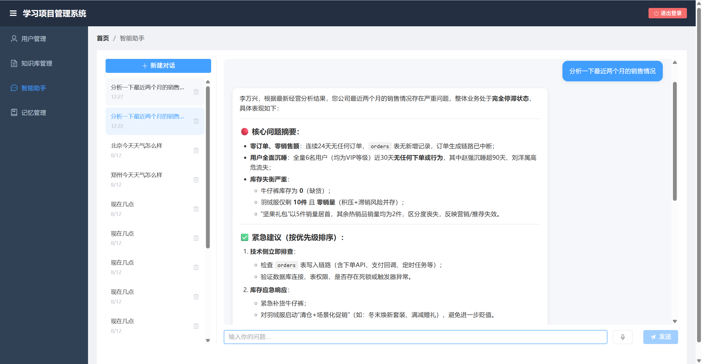
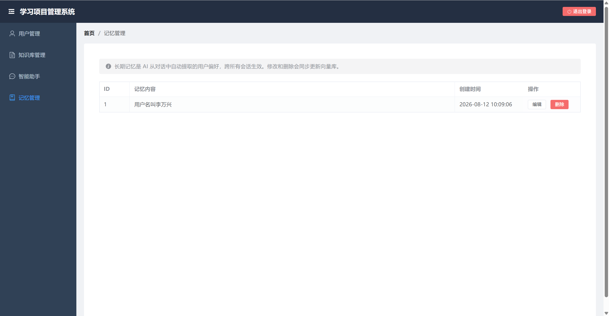
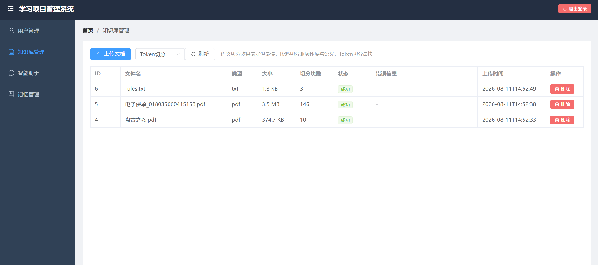

# liwanxing-learning-projects

[](https://github.com/liwanxing/liwanxing-learning-projects/actions/workflows/ci.yml)

基于 **Spring Boot 4 + Spring AI 2.0** 的企业级智能助手，完整覆盖 LLM 应用工程的核心链路：Agent 工具调用、RAG 质量优化、多层记忆、语义缓存、MCP 双向互通、可观测性与数据生命周期管理。

> 一个从 0 演进到生产化思维的 AI 应用：不只是"能跑"，还回答了**"为什么这样设计、还能怎么坏、坏了怎么办"**。设计取舍详见 [DESIGN.md](DESIGN.md)。

## 功能总览

### 智能助手（Agent 模式）

模型根据问题自主决定调用哪个工具，无需手写路由逻辑；前端 SSE 流式输出，支持图片上传多模态对话：

| 工具 | 能力 | 来源 |
|------|------|------|
| **RagTool** | 知识库混合检索 + RRF 融合 + Rerank + 窗口扩容 | 本地 |
| **ResearchTool** | 深度调研（调 Python LangGraph Agent，熔断保护） | HTTP 跨语言 |
| **WeatherTool** | 高德 API 天气查询 | HTTP |
| **UserQueryTool** | 查询系统用户/角色/权限 | 本地 MySQL |
| **TimeTool** | 当前时间 | 本地 |
| **graph-analysis** | 经营分析（MCP Client 动态发现） | MCP 远程，开关可关 |



### RAG 检索质量链路（核心亮点）

不是"向量检索一把梭"，而是七段式质量流水线，每段都有明确的工程理由：

```
用户提问 "那个报销的东西在哪点"
  ↓ ① 查询改写（qwen-flash，Multi-Query）："费用报销流程 操作入口" 等 3 个变体，口语→规范提升召回
  ↓ ② 混合检索：向量（语义）+ MySQL 全文（字面）两路并行，单路失败降级不拖全局
  ↓ ③ RRF 融合 + 粗筛（同一方法）：各路按排名倒数 1/(k+rank) 求和统一打分，多路共识天然靠前；top-8 送精排
  ↓ ④ Rerank 精排（gte-rerank-v2，用原始查询对齐真实意图）
  ↓ ⑤ 窗口扩容（small-to-big）：命中 chunk 反查相邻段拼接，防答案卡在切分边界
  ↓ ⑥ 合并后复评 + 置信度门控（CombMNZ）：拼接段同时命中向量+倒排两路给加成，对最终资料拒答/放行
  ↓ ⑦ 生成回答（基于检索资料）
  旁路：语义缓存——相似问题命中直接返回（0 token、毫秒级）
```

### MCP 双向互通

一个项目同时扮演两种角色，"一个内核，两壳暴露"：

- **MCP Client**：消费 graph-learning-java 项目暴露的经营分析工具（`MCP_ENABLED` 开关控制，不强依赖远程服务）
- **MCP Server**：把 RAG 知识库暴露为标准 MCP 工具（`search_knowledge_base`），Claude Desktop / Cursor 等外部 AI 客户端可直接接入本项目知识库（Streamable HTTP，端点 `/mcp`）

### 三层记忆系统（存用分离）

| 层级 | 实现 | 说明 |
|------|------|------|
| **短期窗口** | ChatMemory（MySQL） | **存储 500 条 / 模型上下文 30 条分离**：数据库是完整档案（约 250 轮可回看），模型只看滑动窗口 |
| **滚动摘要** | ConversationSummaryAdvisor | 溢出消息自动压缩成摘要注入 system，早期对话不丢失 |
| **长期记忆** | UserMemoryService（MySQL+Milvus 双写） | AI 自动提取用户偏好，跨所有会话语义召回 |



### 知识库管理

文档上传（PDF/TXT/DOC/MD）→ Tika 解析 → 切分（TOKEN/FIXED/SEMANTIC 三策略）→ 向量化入 Milvus，异步处理 + 状态轮询 + 失败重试；删除时同步清 Milvus 向量 + 本地文件 + 记录，并主动失效语义缓存。



### 数据生命周期管理

历史数据不会无限膨胀：每天凌晨 3 点定时清理 180 天未活跃的会话"四件套"（消息原文 + 摘要 + 聊天图片文件 + 会话记录），锚定删除保证幂等可重试，分批执行防大事务。

## 技术亮点与设计取舍

> 每条都对应真实的工程问题，面试聊项目的弹药库（完整版见 [DESIGN.md](DESIGN.md)）

1. **置信度门控防幻觉**：Rerank 分数不是概率是相对值，阈值宁低勿高（0.3 起步）——设高了把该答的拒掉，比答得一般更伤体验；校准方法是跑批量评估看分数分布
2. **记忆存用分离（装饰器模式）**：`MessageWindowChatMemory` 默认把"存多少"和"模型看多少"绑死（30 条物理删除，历史回看断裂）。用 `ReadLimitChatMemory` 装饰 `get()` 只截读取，存储放开到 500——摘要压缩逻辑零改动，回看接口不受影响
3. **一个内核两壳暴露**：RagTool（`@Tool`，对内 Function Calling 进程内直调）与 RagMcpTools（`@McpTool`，对外 MCP 协议）共用同一检索内核——对内不绕协议回环，对外标准互通
4. **工具动态筛选（RAG of tools）**：全量注册时每个工具的 name + description + 参数 Schema 都随请求发给模型——token 线性膨胀，候选越多选得越不准。`ToolRegistryService` 三层漏斗：常驻万金油（漏召回兜底）→ `@ToolPermission` 权限过滤（模型调工具绕过接口层，候选池必须再挡一道）→ 向量 top-3 预筛（一次 embedding 的成本换掉无关工具 token）；MCP 远程工具同样收编；Milvus 挂了降级为权限内全量——筛选是优化不是功能
5. **语义缓存四重防护**：过短问题跳过（代词/省略式追问依赖上文，缓存 key 只有 query 本身）、敏感词表跳过动态问题（“现在几点”缓存必出错）、多模态消息跳过、TTL + 文档变更主动失效；Advisor 放最内层——命中短路时记忆读写照常，Langfuse 拿不到 Usage 不会记 token 账，账本不重复计
6. **多路检索并行化 + RRF 融合**：`CompletableFuture.allOf` 协调 4 路变体检索，单路失败降级空结果不拖全局；固定小线程池 + `CallerRunsPolicy` 天然背压。合并用 RRF（排名倒数求和）替代“先到优先”：向量分和全文分不可比，排名才是公共语言，多路都命中的 chunk 天然高分；融合分同时是 Rerank 前粗筛的砍量依据（按条数计费的精排先砍量）
7. **检索后处理两件套（small-to-big + CombMNZ 复评）**：窗口扩容——chunk ID 自带 doc{docId}_{index} 位置，命中的 top-3 用一条元组 IN 反查相邻段拼成完整上下文，防“答案正好卡在切分边界”；拼接后重打一轮分（CombMNZ 思想）：span 同时命中向量和倒排两路给加成，“语义像”+“字面像”双重佐证；置信度门控放在最后——拿到模型真正要看的最终资料再拒答/放行
8. **幂等删除 + 锚定重试**：清理会话时"会话记录"最后删——中途失败，下轮任务能重新扫到重删（每步幂等）；整批失败则止损退出，防 while 死循环
9. **跨语言/跨系统 Agent 协作**：Java 主 Agent + Python LangGraph（深度调研，Resilience4j 熔断保护）+ MCP 消费另一个 Java 项目的分析工具——三种集成方式（HTTP 工具、MCP、本地工具）各就其位
10. **流式输出的现实工程**：绕开 DashScope 流式工具调用 ID 为空的 bug（同步调用 + 拆行 SSE 假流），同时解决 SSE 换行丢事件问题

## 架构图

```
┌───────────────────────────────────────────────────────────────┐
│                    前端（Vue 3 + Element Plus）                 │
│      智能助手（SSE 流式/图片） │ 知识库 │ 记忆管理 │ 用户管理    │
└───────────────────────────┬───────────────────────────────────┘
                            │ HTTP / SSE
┌───────────────────────────┴───────────────────────────────────┐
│                 后端（Spring Boot 4 + Spring AI 2.0）           │
│                                                                │
│  请求流：Advisor 链（长期记忆 → 短期记忆[读取截断]                │
│          → 滚动摘要 → 语义缓存[命中短路] → LLM）                 │
│                                                                │
│  ┌──────────────── Agent 工具（Function Calling）────────────┐ │
│  │ RagTool     ：改写→检索→RRF+粗筛→Rerank→扩容→复评门控  │ │
│  │ ResearchTool：HTTP→Python LangGraph(熔断保护)             │ │
│  │ WeatherTool / TimeTool / UserQueryTool                    │ │
│  │ graph-analysis：MCP Client 动态发现（开关可关）             │ │
│  └───────────────────────────────────────────────────────────┘ │
│                                                                │
│  ┌── MCP Server（对外）──────────┐  ┌── 数据生命周期 ────────┐  │
│  │ search_knowledge_base         │  │ 定时清理 180 天会话     │  │
│  │ Claude Desktop/Cursor 可接入  │  │ 四件套幂等删除          │  │
│  └───────────────────────────────┘  └────────────────────────┘  │
└───────────────────────────────────────────────────────────────┘
        │                │                │               │
   ┌────┴────┐     ┌─────┴────┐     ┌─────┴─────┐   ┌────┴─────┐
   │ MySQL   │     │ Milvus   │     │ Redis     │   │ Python   │
   │ 业务+记忆│     │ 向量+缓存│     │ Sa-Token  │   │ Agent    │
   └─────────┘     └──────────┘     └───────────┘   └──────────┘
                                        │
                                  Langfuse（LLM 可观测）
```

## 快速开始

### 前置要求

- Docker + Docker Compose
- Java 21 + Maven（项目自带 Maven Wrapper）
- Node.js 24 + npm

### 1. 配置 API Key

在项目根目录创建 `application-local.yml`（不提交 git）：

```yaml
spring:
  ai:
    openai:
      api-key: sk-你的通义DashScope密钥

amap:
  api-key: 你的高德地图密钥
```

### 2. 启动基础设施

```bash
docker compose up -d
```

启动 MySQL + Redis + Milvus 三件套。

### 3. 启动后端

IDEA 运行 `LiwanxingLearningProjectsApplication`，或：

```bash
.\mvnw.cmd spring-boot:run
```

访问 http://localhost:8080 （接口文档：http://localhost:8080/doc.html）

### 4. 启动前端

```bash
cd frontend
npm install
npm run dev
```

访问 http://localhost:5173

### 5.（可选）外部 AI 客户端接入知识库

Claude Desktop / Cursor 配置 MCP 服务器 `http://localhost:8080/mcp`，即可让它们检索本项目的 RAG 知识库。

### 运行测试

测试分两层，CI（GitHub Actions）只跑第一层，零外部依赖：

```bash
# 纯单元测试：Mockito mock 依赖，秒级完成，不需要数据库/API Key（CI 跑的就是这个）
.\mvnw.cmd test

# 集成测试：真实调通义 API + Milvus（本地环境就绪后手动跑）
.\mvnw.cmd test -Dgroups=integration
```

### 默认账号

| 用户名 | 密码 | 角色 |
|--------|------|------|
| admin | 123456 | 管理员 |
| zhangsan | 123456 | 编辑者 |
| lisi | 123456 | 访客 |

## 技术栈

| 分类 | 技术 |
|------|------|
| 后端 | Spring Boot 4 + Spring AI 2.0 + MyBatis |
| AI 能力 | Function Calling + RAG 七段链 + Advisor 链 + 三层记忆 |
| 互操作 | MCP Client + MCP Server（Streamable HTTP） |
| 数据库 | MySQL 8.0 + Milvus 2.4 + Redis 7 |
| 认证授权 | Sa-Token + RBAC 五表模型 |
| 服务保护 | Resilience4j 熔断 + Guava 用户级限流 |
| 可观测性 | Langfuse 全链路追踪（含 Token 用量，本地控制台同步一行） |
| 前端 | Vue 3 + Element Plus + SSE 流式 |
| 部署 | Docker + Docker Compose |

## 更多

- [工程设计与思考](DESIGN.md) — 设计决策、取舍理由与踩坑经验（面试素材）
